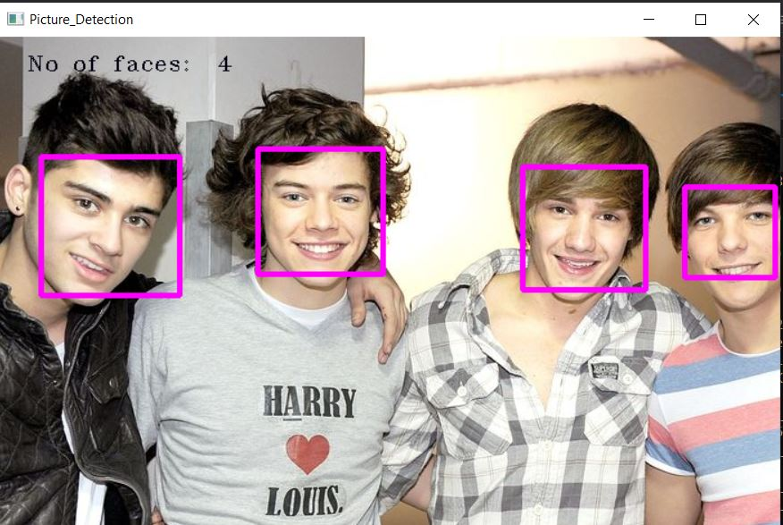

# Real-time-Face-Recognition-OpenCV 4.5.1 & C++
 
### Recognize and manipulate the Faces using Face-Recogniton Application System.
- Program recognizes faces in a live webcam stream.
- Using pre-trained XML classifiers.
- HaarCascades Classifiers.
- Upload Images for Multiple Face-detection.

# Features

# Installation
## Requirements
- [OpenCV 4.5.1](https://opencv.org/)
- [Visual Studio 2019](https://visualstudio.microsoft.com/)
- [HaarCascade_Frontal_Face Classifiers]()
## Setup

## Contact
For any inquiries, reach out at [ashwanik7050@gmail.com]. 
GitHub: [@ashwani1121](https://github.com/ashwani1121). Add commentMore actions
Linkedin: [@ashwani-gupta-894154264](http://www.linkedin.com/in/ashwani-gupta-894154264). 
